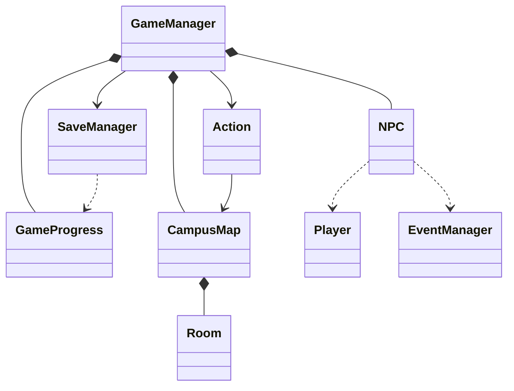
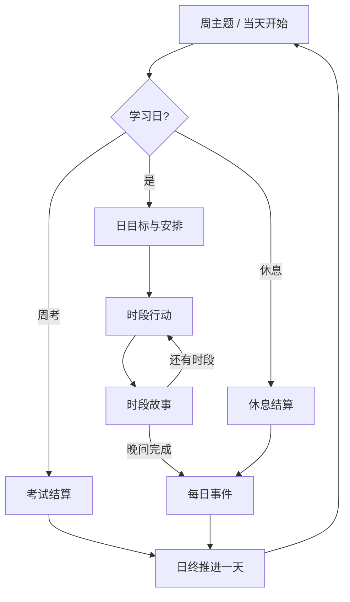

# 核心修复与校园地图、NPC

## 本次范围

保持GameManager调度、Action行动、EventManager事件、SaveManager文件读写的职责。新增GameProgress作为调度进度数据，Room/CampusMap表达地图，NPC表达人物。主流程仍是35天校园模拟。

## 核心修复

- 存档升级V4：时段、阶段、地点、日目标、上周成绩、上次行动、未完成菜单输入、待选择事件、NPC每日交谈记录均保存。保留原三参数存读档接口，并增加包含GameProgress的重载。
- 调度按阶段恢复：周主题、日目标、普通行动、时段故事、周考/休息、每日事件、日终依次推进。中途退出不会跳天，恢复时不重复扣钱或结算学习收益。
- 随机事件首次选出后记录ID，退出重进不会重新抽事件。
- SaveManager先写同目录临时文件，检查写入与关闭成功，再替换目标；Windows使用MoveFileExW，其他平台使用rename。失败时不截断旧存档，并清理本次临时文件。
- 全行解析整数，拒绝1abc、1.5、多余参数和溢出整数。输入结束由调度器统一捕获，停止推进日期。主动退出仅在保存成功后发生。
- 控制台标题使用青色、保存成功绿色、保存错误黄色；重定向输出不写颜色控制序列。

## 类关系与算法

Room保存名称、描述与方向出口；CampusMap用map存储房间，方向移动检查出口，直达选项用queue和前驱map进行广度优先搜索，再反转路径得到最短路线。地图有9个地点，每条连接可双向通行。

NPC保存ID、姓名、地点、可用时段。林晓可在不同时段出现在不同地点，共享同一ID以避免跨地点刷收益。对话读取EventManager已完成的故事选择，根据记录输出不同台词。每日交谈去重集合位于GameProgress并由SaveManager保存。

每个节点完成后保存下一阶段；选择处保存未完成输入。读取旧存档时按旧天数从当天起点继续，旧文件本来未记录的时段无法推断。

## 验证与边界

新增CoreRegression检查严格输入、EOF、地图连通与非法出口、NPC时段、V1—V4存档兼容、非法地点、损坏文件及Windows锁定目标时旧存档不变。保留StoryIntegration检查连续故事、考试分数、行动重放和界面宽度。

runtime_regression.py在临时目录运行实际EXE，检查输入中断不会空跑35天、图书馆子菜单恢复只结算一次、同一NPC读档后不重复奖励、晚间0退出不跳天、随机事件不重抽、沿用安排保持地点，以及完整35天的5次周考和16段故事。

以上为自动化自测，不能代替课程要求的小组互测和真实评分。正式测试报告、WBS、用例图和全项目UML图仍需结合团队实际材料整理。存档采用当前工作目录路径；强制结束进程仅能恢复到最近保存点，不等同于正常保存退出。

2026-09-08实际验证：游戏及两个C++测试以GCC C++17、-Wall -Wextra -Wpedantic -Wconversion -Wshadow编译通过，无警告；CoreRegression、StoryIntegration及实际EXE的runtime_regression.py均通过。当前环境未发现CMake命令，因此测试以直接编译方式执行，新增CTest注册配置未在本机运行验证。游戏与测试均在临时目录完成构建与测试，最终只更新build/铃响之前.exe。
